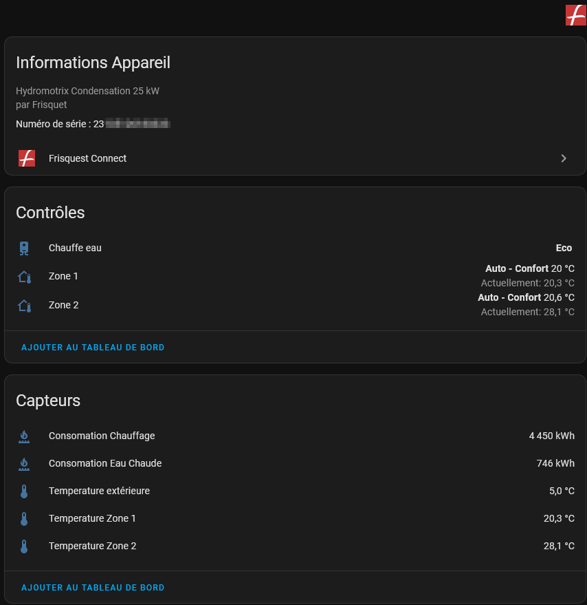

[![HACS Custom][hacs_shield]][hacs]

![GitHub All Releases][downloads_total_shield]

[hacs_shield]: https://img.shields.io/static/v1.svg?label=HACS&message=Custom&style=popout&color=orange&labelColor=41bdf5&logo=HomeAssistantCommunityStore&logoColor=white
[hacs]: https://hacs.xyz/docs/faq/custom_repositories
[releases_shield]:https://img.shields.io/badge/dynamic/json?url=https%3A%2F%2Fraw.githubusercontent.com%2TheGui01%2FFrisquet-connect-for-home-assistant%2Fmain%2Fcustom_components%2Ffrisquet_connect%2Fmanifest.json&query=%24.version&label=relea
[downloads_total_shield]: https://img.shields.io/github/downloads/TheGui01/Frisquet-connect-for-home-assistant/total

# Frisquet Connect For Homme Assistant

## Installation

1- Copy the folder frisquet_connect into your custom_components folder 
2- Restart HA and add the integration Frisquet connect from Device -> Add integration 
3- Enter your Username and Password 
You have now your climate Zone 1 created 
Several Zones will be supported in a future version

## Features : Frisquet vs HA logic

- Supports Zone 1 & Zone 2, Boiler and provides temperature sensors associated and external temperature the sensor if available.
- HVAC Modes :
    - Auto means there are no derogation. It's following Cycles Réduit & Confort that are programmed. As soon as you have a derogation / Boost / permanent state, you are either on HVAC mode Chauffe or OFF. 
    - Chauffe is activated if current temperature is lower than the temprature of the derogation you have set. You should see the state chauffe is not everytime immediate as we don't take in account the temperature of the mode, but another temperature adjusted in function of mode set directly on the boiler. 
    - Off is set if you are in a derogated mode and current temperature is higer than the temprature of the derogation you have set 

The swtich to Auto will cancel any derogation. 
Switch to OFF or Chauffe has no effect. 

- Preset Modes :
    - Réduit & Confort : Combinated with HVAC Mode Auto means you are in Auto and the preset decribes in which mode you are currently setup. Any switch between Réduit and Confort will activate a derogation mode : HVAC Mode will switch in Chauffe. This derogation will be kept until the next cycle.

    - Réduit Permanent, Confort Permanent, Hors Gel : If chosen, HVAC Mode = Chauffe. Switch back HVAC mode to Auto to stop the "Permanent" mode

    - Boost Mode : Should behave like Permanent mode : to be tested...

