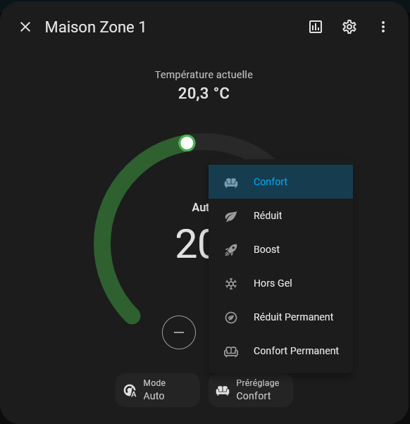

[![HACS Custom][hacs_shield]][hacs]

[hacs_shield]: https://img.shields.io/static/v1.svg?label=HACS&message=Custom&style=popout&color=orange&labelColor=41bdf5&logo=HomeAssistantCommunityStore&logoColor=white
[hacs]: https://hacs.xyz/docs/faq/custom_repositories
[releases_shield]:https://img.shields.io/badge/dynamic/json?url=https%3A%2F%2Fraw.githubusercontent.com%2TheGui01%2FFrisquet-connect-for-home-assistant%2Fmain%2Fcustom_components%2Ffrisquet_connect%2Fmanifest.json&query=%24.version&label=relea

# Frisquet Connect For Home Assistant

## Installation

### HACS

Frisquet connect is available in HACS (Home Assistant Community Store).

_or_

1. Install HACS if you don't have it already
2. Open HACS in Home Assistant
3. Search for "Frisquet"
4. Click the download button. ⬇️

### local install

1- Copy the folder frisquet_connect into your custom_components folder 
2- Restart HA and add the integration Frisquet connect from Device -> Add integration 
3- Enter your Username and Password 

## Features : Frisquet vs HA logic

- Supports Zone 1 & Zone 2, Water heater, provides temperature sensors associated and external temperature the sensor if available.
- HVAC Modes :
    - Auto means there are no derogation. It's following Cycles Réduit & Confort that are programmed. As soon as you have a derogation or a permanent state, you are either on HVAC mode Chauffe or OFF. 
    - Chauffe is activated if current temperature is lower than the temprature of the derogation you have set. You should see the state chauffe is not everytime immediate as we don't take in account the temperature of the mode, but another temperature adjusted in function of mode set directly on the boiler. 
    - Off is set if you are in a derogated mode and current temperature is higer than the temprature of the derogation you have set 

The swtich to Auto will cancel any derogation. 
Switch to OFF or Chauffe has no effect. 

- Preset Modes :
    - Réduit & Confort : Combinated with HVAC Mode Auto means you are in Auto and the preset decribes in which mode you are currently setup. Any switch between Réduit and Confort will activate a derogation mode : HVAC Mode will switch in Chauffe. This derogation will be kept until the next cycle.

    - Réduit Permanent, Confort Permanent, Hors Gel : If chosen, HVAC Mode = Chauffe or Off. Switch back HVAC mode to Auto to stop the "Permanent" mode

    - Boost Mode available

- Consumption : 
There are 2 sensors that retrieve total consumption (not on monthly basis). 
You can add them into your energy dashboard to gas consumption. Value will appear 1 day you add them into it : 
As Frisquet updates value only once per day, each sensor will be updated over the night. 
Please consider that values you will get will have 1 day offset : HA will record data at a D day whereas it is D-1 value. 
If you want more accurate values and you have a Gazpar Gas meter (France), I recommend you to see those 2 videos below : 
https://youtu.be/YMdMFE2ysZE?si=W_hLeRye67dGsnlm  &  https://youtu.be/mjTrnnkuIUk?si=RKshhFiMmjamkC3i This setup allows to have accurate data that will be recorded for every 30 minutes in your energy dashboard. You can also track instant consumption with a derivative sensor.

