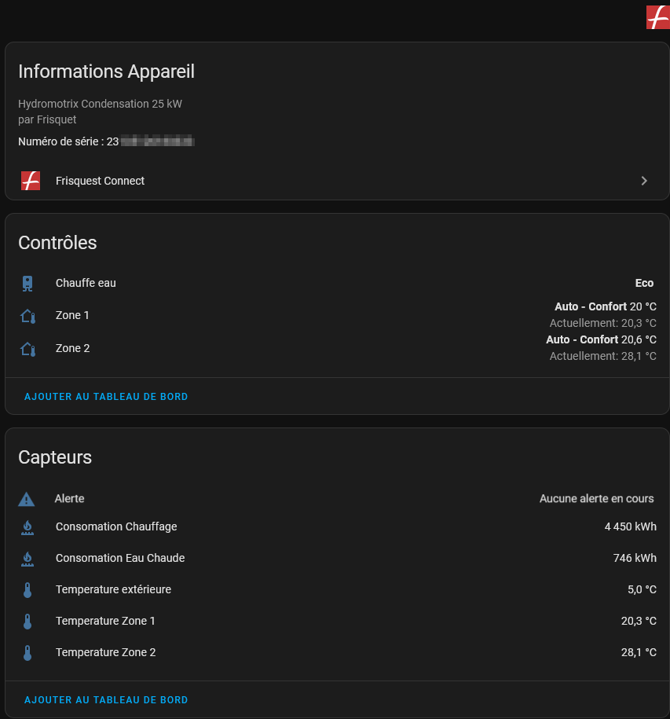

# Frisquet-connect-for-home-assistant
This repository contains the Frisquet API that can be integrated in Home Assistant.

## Features

- Create climate entity Zone 1 and Zone 2 (if available)
- Create 1 temperature sensor per zone availabe and 1 External temperature if available
- Preset mode : Confort, Réduit, Hors Gel, Réduit Permanent and Boost are retrieved from the API.
- HVAC Mode : HVAC Mode is set to Auto if there is neither Dérogation active nor any Permanent mode active. If so HVAC Mode will switch to Chauffe or Off and you can revert any derogation by seting HVAC Mode to Auto

## Futur release

- Add Water Heater entity to control Boiler